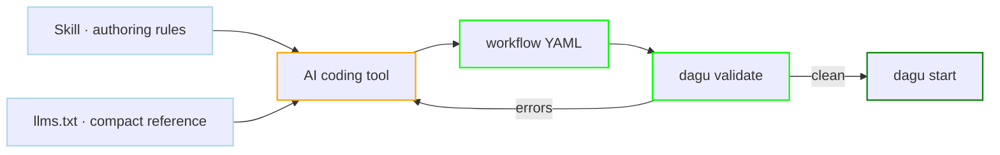

# Authoring with AI

An AI coding tool that has never seen Dagu will invent field names. Three things fix that, and they stack: a skill that teaches the shape of a DAG, a compact reference the model can read in one pass, and a validator that rejects what is still wrong.



## Install the skill

The Dagu skill ships in the repository and installs through the GitHub CLI:

```bash
gh skill install dagucloud/dagu dagu
```

It carries the authoring rules that are easy to get wrong from general knowledge: when to reach for `type: graph` over `type: agent`, why `id` belongs on every step, when `action: template.render` beats a shell heredoc, and which `file.*` action replaces shelling out to `cp` or `mkdir`. It loads task-specific references on demand rather than all at once, covering step types, the CLI, Dagu Actions, harnesses, and build DAGs.

Run `gh skill install --help` for tool-specific installation targets.

## Point a tool at llms.txt

`llms.txt` is the same material flattened into a single file for tools that read a URL instead of installing a skill:

```text
https://raw.githubusercontent.com/dagucloud/dagu/main/llms.txt
```

It is generated from the skill sources, so the two never drift. Paste the URL into a tool that fetches context, or keep a copy next to the workflows in a repository so the reference is available offline.

## Let the tool check its own work

Neither a skill nor a reference file guarantees correct YAML. Two commands close the loop, and both are worth putting in front of an agent explicitly:

```bash
dagu validate workflow.yaml
dagu schema dag steps
```

`validate` builds the DAG and reports the same errors the server would, without running anything. `schema` prints the accepted fields for any dot-separated path (`dagu schema dag steps.container`), so an agent can look up a shape instead of guessing it. Telling a coding tool to run `dagu validate` after every edit turns a plausible-looking file into a verified one, and the same command is what checks every YAML example in this documentation.

## Operating a server instead of writing files

Authoring stops at the file. When an AI tool should read run state, apply scoped edits, maintain Wiki pages, or control runs on a live server, that is the [MCP server](/mcp/), not the skill.

| Integration | Configure | Best for |
|---|---|---|
| Skill or `llms.txt` | `gh skill install dagucloud/dagu dagu` | Writing valid workflow YAML in an editor or repository. |
| MCP server | `http://localhost:8080/mcp` | Reading state, applying scoped edits, and controlling runs on a running server. |

Most setups want both: the skill so the tool writes correct YAML, and MCP so it can see what happened when the workflow ran. See [MCP Clients](/mcp/clients/) for the thirteen client-specific guides.

## Regenerating the reference

Contributors editing the skill sources under `skills/dagu` regenerate the flattened file with:

```bash
make llms
```

Both surfaces are checked in, so a change to the skill needs the regenerated `llms.txt` in the same commit. See [Contributing](/overview/contributing).
