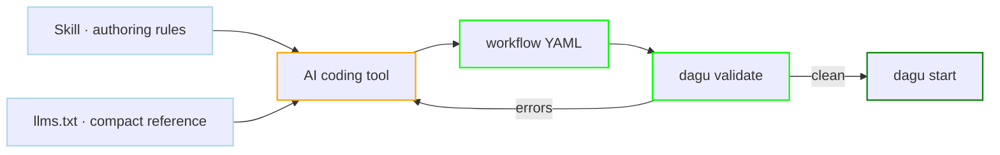

# Skills

The Dagu skill is a packaged authoring reference for AI coding tools. It ships in the repository and covers which DAG type to pick, the step fields, the built-in actions, the harnesses, and the CLI. Reference files load per task rather than all at once.

`llms.txt` is the same material flattened into one file, for tools that read a URL instead of installing a skill.

Both target tools working on files. When a server is running, [MCP](/mcp/) is the better path: it supplies the reference itself and checks every edit before it is saved.



## Install the skill

Install it with the GitHub CLI:

```bash
gh skill install dagucloud/dagu dagu
```

It carries the authoring rules that are easy to get wrong from general knowledge: when to reach for `type: graph` over `type: agent`, why `id` belongs on every step, when `action: template.render` beats a shell heredoc, and which `file.*` action replaces shelling out to `cp` or `mkdir`. It loads task-specific references on demand rather than all at once, covering step types, the CLI, Dagu Actions, harnesses, and build DAGs.

Run `gh skill install --help` for tool-specific installation targets.

## Point a tool at llms.txt

The flattened file lives at:

```text
https://raw.githubusercontent.com/dagucloud/dagu/main/llms.txt
```

It is generated from the skill sources, so the two never drift. Paste the URL into a tool that fetches context, or keep a copy next to the workflows in a repository so the reference is available offline.

## Let the tool check its own work

Neither a skill nor a reference file guarantees correct YAML. Two commands close the loop, and both are worth putting in front of an agent explicitly:

```bash
dagu validate workflow.yaml
dagu schema dag steps
```

`validate` builds the DAG and reports the same errors the server would, without running anything. `schema` prints the accepted fields for any dot-separated path (`dagu schema dag steps.container`), so an agent can look up a shape instead of guessing it. Telling a coding tool to run `dagu validate` after every edit turns a plausible-looking file into a verified one, and the same command is what checks every YAML example in this documentation.

## When to use MCP instead

A skill stops at the file. [MCP](/mcp/) covers the same authoring job and more, which is why it is the recommended path whenever a server is running.

| | Skill or `llms.txt` | MCP |
|---|---|---|
| Configure | `gh skill install dagucloud/dagu dagu` | `http://localhost:8080/mcp` |
| Needs a running server | No | Yes |
| Authoring reference | Installed on the client | Supplied by the server |
| Validation | You tell the tool to run `dagu validate` | The server checks every edit before it is saved |
| After the edit | Nothing further | Starts the run, reads logs, debugs the failure |

Use the skill when the tool edits files with no server to reach, or alongside MCP when you want the authoring rules present in the editor too. See [MCP Clients](/mcp/clients/) for per-client setup.

## Regenerating the reference

Contributors editing the skill sources under `skills/dagu` regenerate the flattened file with:

```bash
make llms
```

Both surfaces are checked in, so a change to the skill needs the regenerated `llms.txt` in the same commit. See [Contributing](/overview/contributing).
