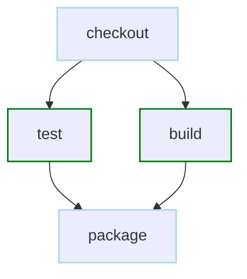
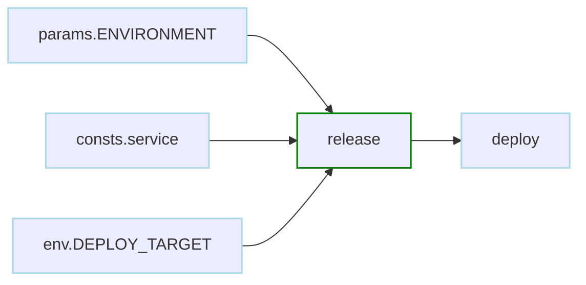
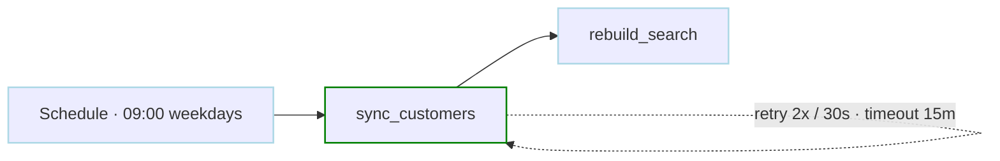
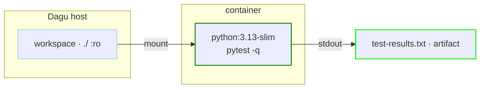
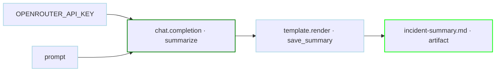
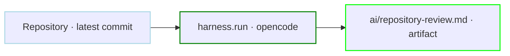
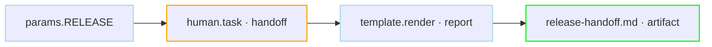
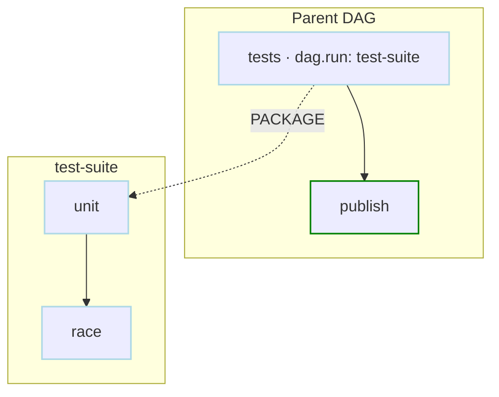

# Workflow building blocks

## Recipes

Each recipe below is a complete, copyable workflow that combines Dagu's building blocks.

<nav class="basic-recipe-map" aria-label="Basic workflow recipes">
  <a href="#commands-become-a-graph"><b>01</b><span>Commands become a graph</span></a>
  <a href="#typed-values-move-between-steps"><b>02</b><span>Typed values move</span></a>
  <a href="#run-on-schedule-and-recover"><b>03</b><span>Schedule and recover</span></a>
  <a href="#run-a-step-in-docker-or-podman"><b>04</b><span>Docker or Podman</span></a>
  <a href="#call-an-llm"><b>05</b><span>Call an LLM</span></a>
  <a href="#run-a-coding-agent"><b>06</b><span>Run a coding agent</span></a>
  <a href="#collect-human-input-and-create-an-artifact"><b>07</b><span>Human input to artifact</span></a>
  <a href="#compose-reusable-workflows"><b>08</b><span>Compose sub-workflows</span></a>
</nav>

<div class="basic-recipes">

<section class="basic-recipe" data-basic-recipe="command_graph">

### Commands become a graph

<p class="recipe-outcome">Start with existing scripts. Independent steps run together; a dependent step waits for both.</p>

```yaml
type: graph
steps:
  - id: checkout
    run: git checkout main

  - id: test
    depends: [checkout]
    run: ./scripts/test

  - id: build
    depends: [checkout]
    run: ./scripts/build

  - id: package
    depends: [test, build]
    run: ./scripts/package
```



<a href="/writing-workflows/basics#dependencies" class="learn-more" data-basic-learn-more>Dependencies and parallel execution →</a>

</section>

<section class="basic-recipe" data-basic-recipe="typed_values">

### Typed values move between steps

<p class="recipe-outcome">Validate parameters at the boundary and publish structured values for downstream steps.</p>

```yaml
params:
  - name: ENVIRONMENT
    type: string
    enum: [staging, production]
    required: true
    default: staging

consts:
  - service: payments

env:
  - DEPLOY_TARGET: "${consts.service}-${params.ENVIRONMENT}"

steps:
  - id: release
    output:
      version: v2.5.0
      target: ${env.DEPLOY_TARGET}

  - id: deploy
    depends: [release]
    run: ./deploy --version '${release.output.version}' --target '${release.output.target}'
```



<a href="/writing-workflows/data-flow" class="learn-more" data-basic-learn-more>Parameters, variables, and data flow →</a>

</section>

<section class="basic-recipe" data-basic-recipe="schedule_recover">

### Run on schedule and recover

<p class="recipe-outcome">Turn a command into an operated job with one cron expression and shared reliability defaults.</p>

```yaml
schedule: "CRON_TZ=America/New_York 0 9 * * 1-5"
catchup_window: 4h

defaults:
  retry_policy:
    limit: 2
    interval_sec: 30
  timeout_sec: 900

steps:
  - id: sync_customers
    run: ./sync-customers --incremental
  - id: rebuild_search
    depends: [sync_customers]
    run: ./rebuild-search-index
```



<a href="/writing-workflows/scheduling" class="learn-more" data-basic-learn-more>Schedules and catch-up behavior →</a>

</section>

<section class="basic-recipe" data-basic-recipe="docker_step">

### Run a step in Docker or Podman

<p class="recipe-outcome">Give one step its exact runtime without containerizing the Dagu server or the rest of the workflow.</p>

```yaml
steps:
  - id: test_in_container
    action: docker.run
    with:
      image: python:3.13-slim
      pull: missing
      auto_remove: true
      working_dir: /workspace
      volumes:
        - .:/workspace:ro
      command: python -m pytest -q
    stdout:
      artifact: test-results.txt
```



Set `DAGU_CONTAINER_RUNTIME=podman` to use a Docker-compatible Podman socket.

<a href="/step-types/docker" class="learn-more" data-basic-learn-more>Container execution options →</a>

</section>

<section class="basic-recipe" data-basic-recipe="chat_completion">

### Call an LLM

<p class="recipe-outcome">Use a model as an ordinary step, capture its answer, and pass it into the rest of the graph.</p>

```yaml
secrets:
  - name: OPENROUTER_API_KEY
    provider: env
    key: OPENROUTER_API_KEY

llm:
  provider: openrouter
  model: deepseek/deepseek-v4-flash

steps:
  - id: summarize
    action: chat.completion
    with:
      prompt: Summarize today's incident log in five bullets.
    output:
      summary:
        from: stdout

  - id: save_summary
    depends: [summarize]
    action: template.render
    with:
      template: "# Incident summary\n\n{{ .summary }}\n"
      data:
        summary: ${summarize.output.summary}
    stdout:
      artifact: incident-summary.md
```



<a href="/step-types/llm/" class="learn-more" data-basic-learn-more>Chat completions and model configuration →</a>

</section>

<section class="basic-recipe" data-basic-recipe="coding_agent">

### Run a coding agent

<p class="recipe-outcome">Run OpenCode, Codex, Claude Code, Copilot, or Pi as a durable workflow step with retries, logs, and artifacts.</p>

```yaml
working_dir: .

tools:
  - anomalyco/opencode@v1.18.11

secrets:
  - name: OPENROUTER_API_KEY
    provider: env
    key: OPENROUTER_API_KEY

steps:
  - id: review
    action: harness.run
    with:
      provider: opencode
      model: openrouter/deepseek/deepseek-v4-flash
      prompt: |
        Review the most recent commit without modifying files.
        Return short Markdown with a summary, risks, and verdict.
    retry_policy:
      limit: 2
      interval_sec: 30
    stdout:
      artifact: ai/repository-review.md
```



The pinned tool is installed for the run, so the worker does not need OpenCode preinstalled.

<a href="/step-types/harness/" class="learn-more" data-basic-learn-more>Coding-agent providers and sandboxing →</a>

</section>

<section class="basic-recipe" data-basic-recipe="human_artifact">

### Collect human input and create an artifact

<p class="recipe-outcome">Dagu generates a typed form, persists the answer, resumes the same run, and renders a result visible in the Web UI.</p>

```yaml
params:
  - name: RELEASE
    default: v1.4.0

steps:
  - id: handoff
    action: human.task
    with:
      prompt: Complete the handoff for ${params.RELEASE}
      form:
        type: object
        additionalProperties: false
        properties:
          environment:
            type: string
            enum: [staging, production]
          change_ticket:
            type: string
            pattern: '^CHG-[0-9]+$'
        required: [environment, change_ticket]

  - id: report
    depends: [handoff]
    action: template.render
    with:
      template: |
        # Release {{ .release }}
        Environment: {{ .environment }}
        Change: {{ .ticket }}
      data:
        release: ${params.RELEASE}
        environment: ${steps.handoff.outputs.environment}
        ticket: ${steps.handoff.outputs.change_ticket}
    stdout:
      artifact: release-handoff.md
```



`human.task` is a processless root-DAG step. It collects input and completes; use an [approval gate](/writing-workflows/approval) when reviewers must approve, reject, or push work back.

<a href="/writing-workflows/human-tasks" class="learn-more" data-basic-learn-more>Human tasks and generated forms →</a>

</section>

<section class="basic-recipe" data-basic-recipe="sub_workflow">

### Compose reusable workflows

<p class="recipe-outcome">A child DAG is a real nested run with its own graph, logs, and status. Inputs cross the boundary explicitly.</p>

```yaml
type: graph
steps:
  - id: tests
    action: dag.run
    with:
      dag: test-suite
      params:
        PACKAGE: ./internal/runtime

  - id: publish
    depends: [tests]
    run: ./publish-results
---
name: test-suite
type: graph
params:
  - name: PACKAGE
    type: string
    required: true
steps:
  - id: unit
    run: go test '${params.PACKAGE}'
  - id: race
    run: go test -race '${params.PACKAGE}'
```



Child DAGs do not inherit the parent's environment. Pass every required value through `with.params`.

<a href="/writing-workflows/sub-dags" class="learn-more" data-basic-learn-more>Nested runs and sub-DAG outputs →</a>

</section>

</div>

## Next steps

<div class="basic-next-grid">
  <a href="/writing-workflows/examples/actions-integrations"><b>Operate anything</b><span>SSH, mail, HTTP, Kubernetes, databases, object storage, and more.</span></a>
  <a href="/writing-workflows/examples/control-flow"><b>Add decisions</b><span>Conditions, routing, repetition, approvals, and dynamic execution.</span></a>
  <a href="/writing-workflows/examples/reliability"><b>Handle failure</b><span>Lifecycle handlers, backoff, continuation, and notifications.</span></a>
  <a href="/writing-workflows/incremental-workflows"><b>Reuse unchanged work</b><span>Incremental file pipelines with <code>type: build</code>.</span></a>
</div>
