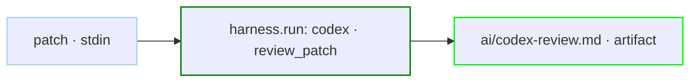
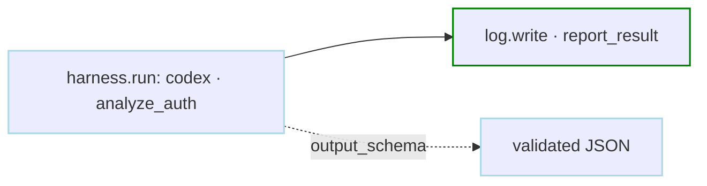
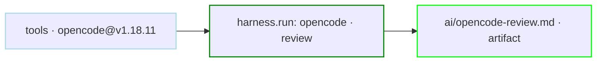
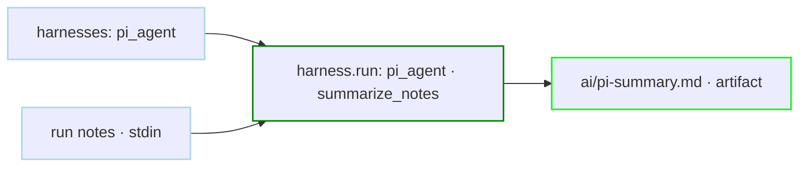

# Harness Run Examples

`harness.run` runs an external agent CLI as a Dagu step. The provider CLI must be installed and authenticated on the worker, provided by a containerized harness, or, for agent CLIs that authenticate with an environment variable, installed per-DAG with [`tools`](/writing-workflows/tools).

These examples keep the workflow shape small and store agent output as run artifacts. `stdout.artifact` and `${context.paths.artifacts_dir}` enable artifact storage automatically.

## Codex Patch Review

Pass a small patch through stdin, choose a strong coding model, tune reasoning, and retry transient CLI failures.

```yaml
steps:
  - id: review_patch
    action: harness.run
    with:
      provider: codex
      # Passed to `codex exec --model`.
      model: gpt-5.5
      # Each entry becomes `--config key=value`.
      config:
        # Use deeper reasoning for review-quality output.
        - model_reasoning_effort=high
        # Return a short reasoning summary when Codex supports it.
        - model_reasoning_summary=concise
        # Keep the final response compact for artifact review.
        - model_verbosity=low
      prompt: |
        Review this patch. Report only correctness risks and missing tests.
      stdin: |
        diff --git a/main.go b/main.go
        --- a/main.go
        +++ b/main.go
        @@ -1 +1 @@
        -panic("todo")
        +return nil
    stdout:
      artifact: ai/codex-review.md
    retry_policy:
      limit: 2
      interval_sec: 30
```



## Validated JSON Result

Ask the agent for one JSON object, validate the complete stdout, and use the
decoded fields in a downstream step.

```yaml
steps:
  - id: analyze_auth
    action: harness.run
    with:
      provider: codex
      prompt: |
        Review the authentication code.
        Return only one JSON object in this form:
        {"summary":"...", "risk":"low|medium|high"}
        Do not include Markdown fences or any other text.
    output_schema:
      type: object
      additionalProperties: false
      required: [summary, risk]
      properties:
        summary:
          type: string
        risk:
          type: string
          enum: [low, medium, high]

  - id: report_result
    depends: [analyze_auth]
    action: log.write
    with:
      message: |
        Risk: ${analyze_auth.output.risk}
        ${analyze_auth.output.summary}
```

`output_schema` validates output after the harness exits successfully. The step
fails if stdout includes logs, Markdown fences, JSONL events, or data that does
not match the schema. This is a step-level feature, so it works with both
built-in providers and custom harness definitions.



## Zero-Install OpenCode Review

Declare the agent under DAG-level [`tools`](/writing-workflows/tools) and Dagu installs the pinned OpenCode release before the run starts, with nothing preinstalled on the worker. The reply is stored as a run artifact.

```yaml
working_dir: .

tools:
  - anomalyco/opencode@v1.18.11

secrets:
  - name: OPENROUTER_API_KEY
    provider: env
    key: OPENROUTER_API_KEY

steps:
  - id: review
    action: harness.run
    with:
      provider: opencode
      # OpenCode expects model IDs in `provider/model` format.
      model: openrouter/deepseek/deepseek-v4-flash
      prompt: |
        Review the most recent commit in this repository.
        Reply with: what changed, one risk, a verdict.
    stdout:
      artifact: ai/opencode-review.md
```

The `secrets` block is required: Dagu does not propagate arbitrary shell variables to steps, and a zero-install worker has no OpenCode auth store to fall back on.



## Pi Summary From Stdin

Define a custom harness when the CLI has option names that need exact mapping. Pi uses `--provider` for the LLM provider, so this example maps `ai_provider` to avoid colliding with Dagu's `with.provider`.

```yaml
harnesses:
  pi_agent:
    # Run the installed Pi CLI instead of the built-in Dagu `pi` adapter.
    binary: pi
    # `--print` makes Pi run once and exit, which is suitable for automation.
    prefix_args: ["--print"]
    # Pass the Dagu prompt as the final positional argument.
    prompt_mode: arg
    prompt_position: after_flags
    # Rename Dagu `with` keys to exact Pi flags where needed.
    option_flags:
      # `provider` is reserved by Dagu, so use `ai_provider` for Pi's LLM provider.
      ai_provider: --provider
      no_context_files: --no-context-files
      no_session: --no-session
      no_tools: --no-tools

steps:
  - id: summarize_notes
    action: harness.run
    with:
      # Select the custom harness definition above.
      provider: pi_agent
      # Passed to Pi as `--provider openrouter`.
      ai_provider: openrouter
      # Passed to Pi as `--model openai/gpt-5.4-mini`.
      model: openai/gpt-5.4-mini
      # Small summarization task, so low reasoning is enough.
      thinking: low
      # Keep the run stateless and prevent file/tool access for this summary.
      no_session: true
      no_context_files: true
      no_tools: true
      prompt: |
        Summarize these run notes in three bullets.
      stdin: |
        Import completed.
        Empty CSV rows were skipped.
        Two malformed records were written to the quarantine report.
    stdout:
      artifact: ai/pi-summary.md
```



## See Also

- [Harness](/step-types/harness/)
- [Harness Sandboxed Execution](/step-types/harness/sandbox/)
- [Artifacts](/writing-workflows/artifacts)
- [Durable Execution](/writing-workflows/durable-execution)
