# Operations Examples

Examples for retention, logs, timeouts, monitoring, tracing, execution control, and full production configuration.

<div class="examples-grid">

<div class="example-card">

### Remote Runbook over SSH

```yaml
ssh:
  user: deploy
  host: web-1.internal
  key: ~/.ssh/deploy_key

steps:
  - id: health
    run: curl -f http://localhost:8080/health
    retry_policy:
      limit: 3
      interval_sec: 10
  - id: restart
    run: systemctl restart myapp
    depends: health
```

Declare `ssh` once and every `run` step executes on that host, with retries, logs, and history kept in Dagu.

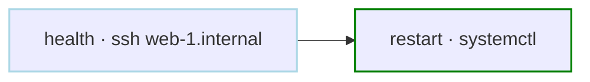

<a href="/step-types/ssh" class="learn-more">Learn more →</a>

</div>

<div class="example-card">

### Patch a Fleet in Parallel

```yaml
steps:
  - id: patch
    action: dag.run
    with:
      dag: patch-host
      params:
        host: ${ITEM}
    parallel:
      items:
        - web-1.internal
        - web-2.internal
        - db-1.internal
      max_concurrent: 2

---
name: patch-host
params:
  - name: host
    type: string
ssh:
  user: deploy
  host: ${params.host}
steps:
  - id: apply
    run: apt-get update -q && apt-get upgrade -y
```

One sub-DAG per host, each with its own logs, status, and retries.

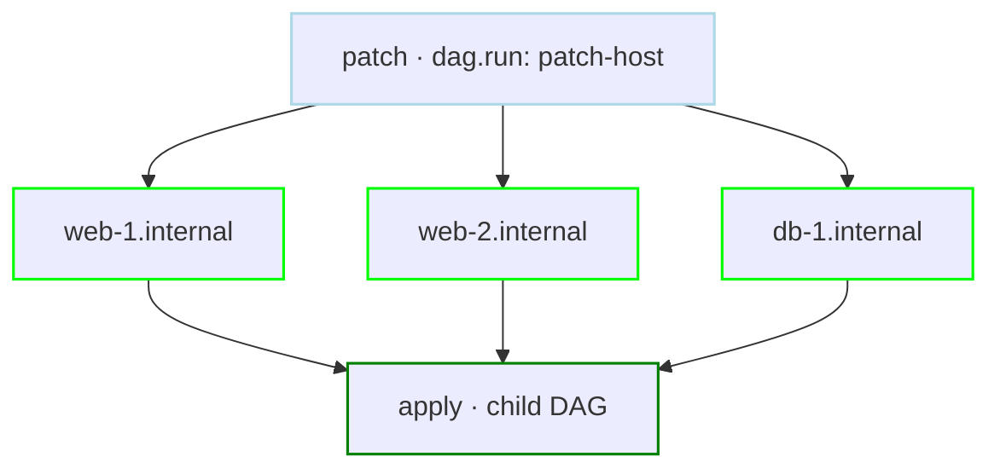

<a href="/step-types/ssh" class="learn-more">Learn more →</a>

</div>

<div class="example-card">

### History Retention

```yaml
hist_retention_days: 30    # Keep 30 days of history
schedule: "0 0 * * *"     # Daily at midnight
steps:
  - id: archive_old_data
    run: echo "Archiving old data"
  - id: cleanup_archive
    run: rm -rf /tmp/archive/*
    depends: archive_old_data
```

Control how long execution history is retained.

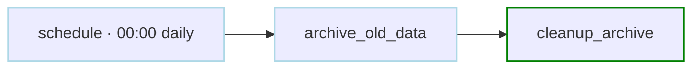

<a href="/writing-workflows/yaml-specification#data-fields" class="learn-more">Learn more →</a>

</div>

<div class="example-card">

### Output Size Management

```yaml
max_output_size: 10485760   # 10MB max output per step
steps:
  - run: ./analyze-logs --format markdown
    stdout:
      artifact: reports/analysis.md
```

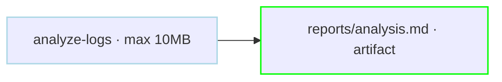

<a href="/writing-workflows/yaml-specification#data-fields" class="learn-more">Learn more →</a>

</div>

<div class="example-card">

### Custom Log Directory

```yaml
log_dir: /data/etl/logs/daily-etl
hist_retention_days: 90
steps:
  - id: extract
    run: echo "Extracting data"
    stdout: extract.log
    stderr: extract.err
  - id: transform
    run: echo "Transforming data"
    stdout: transform.log
    depends: extract
```

Organize logs in custom directories with retention.

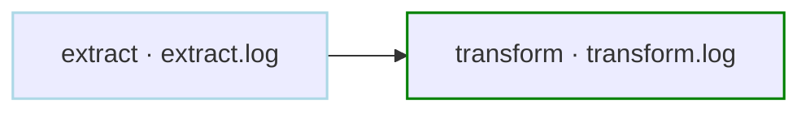

<a href="/writing-workflows/yaml-specification#data-fields" class="learn-more">Learn more →</a>

</div>

<div class="example-card">

### Timeout & Cleanup

```yaml
timeout_sec: 7200          # 2 hour timeout
max_clean_up_time_sec: 600    # 10 min cleanup window
steps:
  - run: sleep 5 && echo "Processing data"
    signal_on_stop: SIGTERM
handler_on:
  exit:
    run: echo "Cleaning up resources"
```

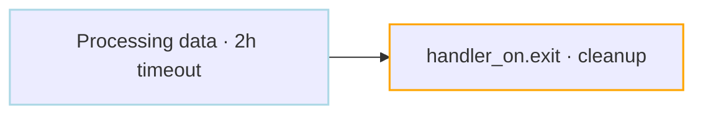

<a href="/writing-workflows/yaml-specification#execution-control-fields" class="learn-more">Learn more →</a>

</div>

<div class="example-card">

### Production Monitoring

```yaml
hist_retention_days: 365    # Keep 1 year for compliance
max_output_size: 5242880    # 5MB output limit
mail_on:
  failure: true
error_mail:
  from: alerts@company.com
  to: oncall@company.com
  prefix: "[CRITICAL]"
  attach_logs: true
info_mail:
  from: notifications@company.com
  to: team@company.com
  prefix: "[SUCCESS]"
handler_on:
  failure:
    run: |
      curl -X POST https://metrics.company.com/alerts \
        -H "Content-Type: application/json" \
        -d '{"service": "critical-service", "status": "failed"}'
steps:
  - run: echo "Checking health"
    retry_policy:
      limit: 3
      interval_sec: 30
```

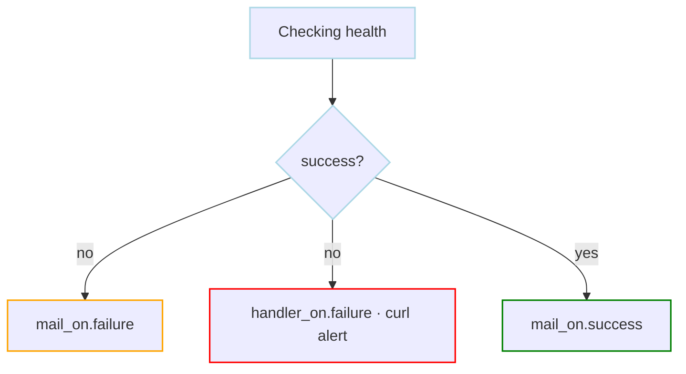

<a href="/writing-workflows/yaml-specification" class="learn-more">Learn more →</a>

</div>

<div class="example-card">

### Distributed Tracing

```yaml
otel:
  enabled: true
  endpoint: "otel-collector:4317"
  resource:
    service.name: "dagu-daily-etl"
    deployment.environment: "production"
tools:
  - astral-sh/uv@0.11.14

steps:
  - id: fetch
    run: echo "Fetching data"

  - id: process
    run: uv run --python 3.13.9 python process.py
    depends: fetch

  - id: transform
    action: dag.run
    with:
      dag: pipelines/transform
    depends: process
```

Enable OpenTelemetry tracing for observability.

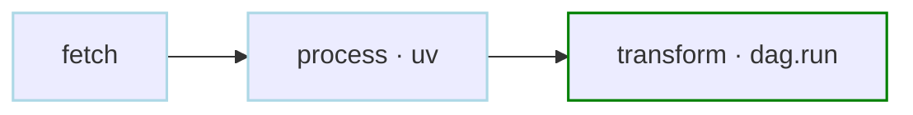

<a href="/server-admin/opentelemetry" class="learn-more">Learn more →</a>

</div>

<div class="example-card">

### Execution Control

```yaml
max_active_steps: 5         # Max 5 parallel steps
queue: "compute-queue"    # Assign to queue for concurrency control
delay_sec: 10              # 10 second initial delay
skip_if_successful: true    # Skip if already succeeded
steps:
  - id: validate
    run: echo "Validating configuration"

  - id: process_batch_1
    run: echo "Processing batch 1"
    depends: validate

  - id: process_batch_2
    run: echo "Processing batch 2"
    depends: validate

  - id: process_batch_3
    run: echo "Processing batch 3"
    depends: validate
```

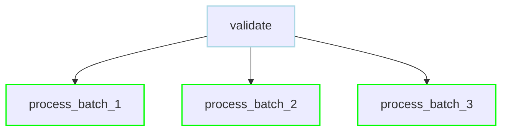

<a href="/writing-workflows/yaml-specification#execution-control-fields" class="learn-more">Learn more →</a>

</div>

<div class="example-card">

### Queuing

```yaml
queue: compute-queue      # Assign to specific queue
steps:
  - id: prepare
    run: echo "Preparing data"

  - id: compute
    run: echo "Running intensive computation"
    depends: prepare

  - id: store
    run: echo "Storing results"
    depends: compute
```

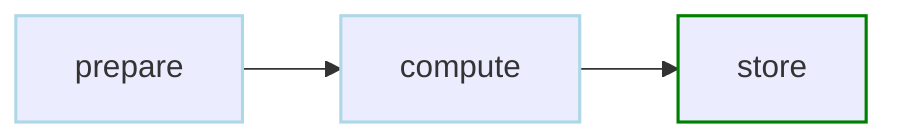

<a href="/writing-workflows/queues" class="learn-more">Learn more →</a>

</div>

<div class="example-card">

### Limit History Retention

```yaml
hist_retention_days: 60     # Keep 60 days history
steps:
  - run: echo "Running periodic maintenance"
```

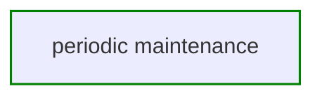

<a href="/writing-workflows/yaml-specification#data-fields" class="learn-more">Learn more →</a>

</div>

<div class="example-card">

### Lock Down Run Inputs

```yaml
run_config:
  disable_param_edit: true   # Prevent editing params at start
  disable_run_id_edit: true   # Prevent custom run IDs

params:
  - ENVIRONMENT: production
  - VERSION: 1.0.0
```

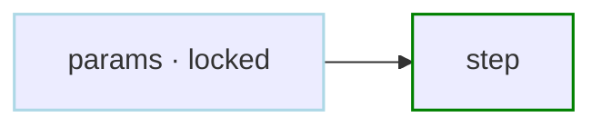

<a href="/writing-workflows/yaml-specification#runconfig" class="learn-more">Learn more →</a>

</div>

<div class="example-card">

### Complete DAG Configuration

```yaml
description: Daily ETL pipeline for analytics
schedule: "0 2 * * *"
skip_if_successful: true
group: DataPipelines
labels: daily,critical
queue: etl-queue          # Assign to global queue for concurrency control
max_output_size: 5242880  # 5MB
hist_retention_days: 90   # Keep history for 90 days
env:
  - LOG_LEVEL: info
  - DATA_DIR: /data/analytics
params:
  - name: ENVIRONMENT
    type: string
    default: production
  - name: DRY_RUN
    type: boolean
    default: false
  - name: DATE
    eval: "`date '+%Y-%m-%d'`"
mail_on:
  failure: true
smtp:
  host: smtp.company.com
  port: "587"
handler_on:
  success:
    run: echo "ETL completed successfully"
  failure:
    run: echo "Cleaning up after failure"
  exit:
    run: echo "Final cleanup"
steps:
  - id: validate_environment
    run: 'echo "Validating environment: ${params.ENVIRONMENT}"'
```

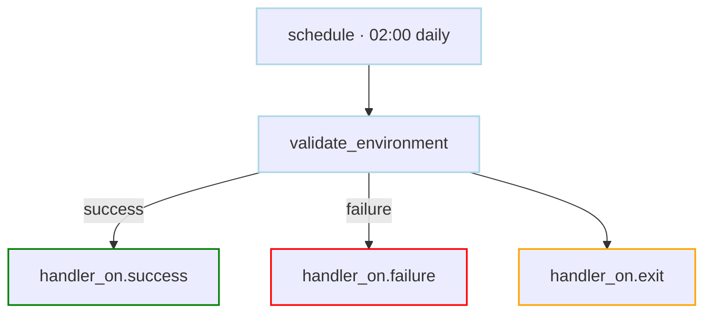

<a href="/writing-workflows/yaml-specification" class="learn-more">Learn more →</a>

</div>

</div>
