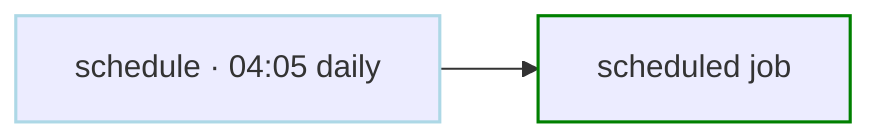
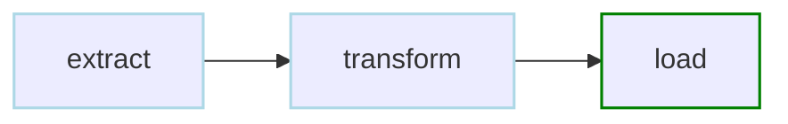
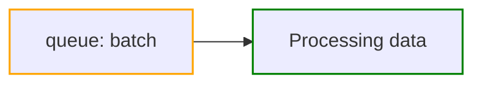
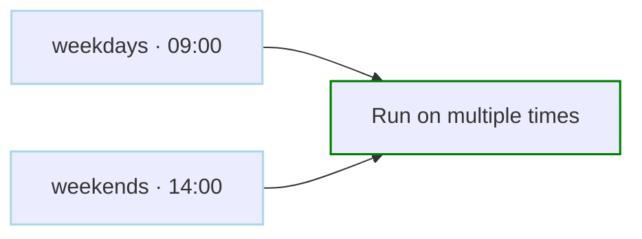
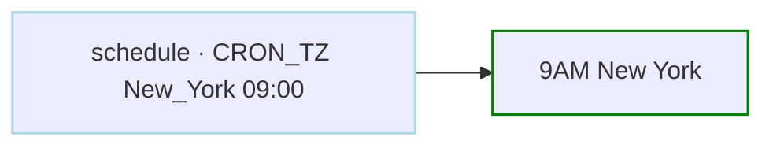
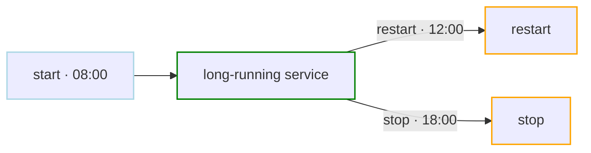
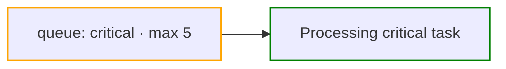
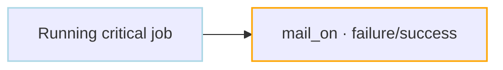

# Scheduling & Queues Examples

Examples for schedules, time zones, queue assignment, global queues, and notifications.

<div class="examples-grid">

<div class="example-card">

### Basic Scheduling

```yaml
schedule: "5 4 * * *"  # Run at 04:05 daily
steps:
  - run: echo "Running scheduled job"
```



<a href="/writing-workflows/scheduling" class="learn-more">Learn more →</a>

</div>

<div class="example-card">

### Skip Redundant Runs

```yaml
schedule: "0 */4 * * *"    # Every 4 hours
skip_if_successful: true     # Skip if already succeeded
steps:
  - id: extract
    run: echo "Extracting data"

  - id: transform
    run: echo "Transforming data"
    depends: extract

  - id: load
    run: echo "Loading data"
    depends: transform
```



<a href="/writing-workflows/scheduling#skip-redundant" class="learn-more">Learn more →</a>

</div>

<div class="example-card">

### Queue Management

```yaml
queue: "batch"        # Assign to global queue for concurrency control
steps:
  - run: echo "Processing data"
```



<a href="/writing-workflows/queues" class="learn-more">Learn more →</a>

</div>

<div class="example-card">

### Multiple Schedules

```yaml
schedule:
  - "0 9 * * MON-FRI"   # Weekdays 9 AM
  - "0 14 * * SAT,SUN"  # Weekends 2 PM
steps:
  - run: echo "Run on multiple times"
```



<a href="/writing-workflows/scheduling#multiple-schedules" class="learn-more">Learn more →</a>

</div>

<div class="example-card">

### Timezone

```yaml
schedule: "CRON_TZ=America/New_York 0 9 * * *"
steps:
  - run: echo "9AM New York"
```



<a href="/writing-workflows/scheduling#timezone-support" class="learn-more">Learn more →</a>

</div>

<div class="example-card">

### Start/Stop/Restart Windows

```yaml
schedule:
  start: "0 8 * * *"     # Start 8 AM
  restart: "0 12 * * *"  # Restart noon
  stop: "0 18 * * *"     # Stop 6 PM
restart_wait_sec: 60
steps:
  - run: echo "Long-running service"
```



<a href="/writing-workflows/scheduling#restart-schedule" class="learn-more">Learn more →</a>

</div>

<div class="example-card">

### Global Queue Configuration

```yaml
# Global queue config in ~/.config/dagu/config.yaml
queues:
  enabled: true
  config:
    - name: "critical"
      max_concurrency: 5
    - name: "batch"
      max_concurrency: 1
```

Assign the queue in the DAG file:

```yaml
queue: "critical"  # Assign to queue for concurrency control
steps:
  - run: echo "Processing critical task"
```



Configure queues globally and assign DAGs using the `queue` field.

<a href="/server-admin/queues" class="learn-more">Learn more →</a>

</div>

<div class="example-card">

### Email Notifications

```yaml
mail_on:
  failure: true
  success: true
smtp:
  host: smtp.gmail.com
  port: "587"
  username: "${env.SMTP_USER}"
  password: "${env.SMTP_PASS}"
steps:
  - run: echo "Running critical job"
    mail_on_error: true
```



<a href="/writing-workflows/email-notifications" class="learn-more">Learn more →</a>

</div>

</div>
