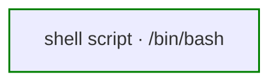
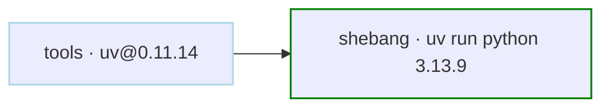
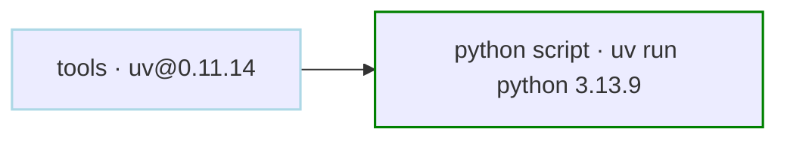
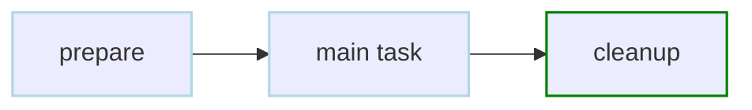
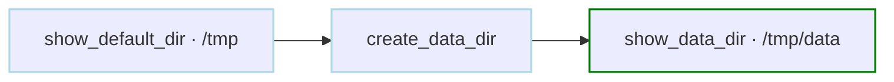
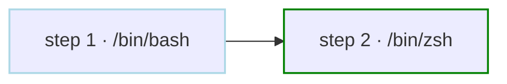
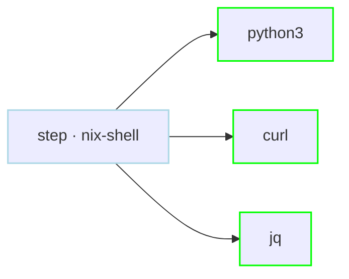

# Scripts & Runtime Examples

Examples for shell scripts, Python scripts, working directories, shell selection, and reproducible runtimes.

<div class="examples-grid">

<div class="example-card">

### Shell Scripts

```yaml
steps:
  - run: |
      #!/bin/bash
      cd /tmp
      echo "hello world" > hello
      cat hello
      ls -la
```

Run shell script with default shell.



<a href="/writing-workflows/basics#scripts" class="learn-more">Learn more →</a>

</div>

<div class="example-card">

### Shebang Script

```yaml
tools:
  - astral-sh/uv@0.11.14

steps:
  - run: |
      #!/usr/bin/env -S uv run --python 3.13.9 python
      import platform
      print(platform.python_version())
```

Runs with the interpreter declared in the shebang.



<a href="/writing-workflows/basics#scripts" class="learn-more">Learn more →</a>

</div>

<div class="example-card">

### Python Scripts

```yaml
tools:
  - astral-sh/uv@0.11.14

steps:
  - run: |
      import os
      import datetime
      
      print(f"Current directory: {os.getcwd()}")
      print(f"Current time: {datetime.datetime.now()}")
    with:
      shell: uv run --python 3.13.9 python
```

Execute script with specific interpreter.



<a href="/writing-workflows/basics#scripts" class="learn-more">Learn more →</a>

</div>

<div class="example-card">

### Multi-Step Scripts

```yaml
steps:
  - run: |
      #!/bin/bash
      set -e
      
      echo "Starting process..."
      echo "Preparing environment"
      
      echo "Running main task..."
      echo "Running main process"
      
      echo "Cleaning up..."
      echo "Cleaning up"
```



<a href="/writing-workflows/basics#scripts" class="learn-more">Learn more →</a>

</div>

<div class="example-card">

### Working Directory

```yaml
working_dir: /tmp
steps:
  - id: show_default_dir
    run: pwd               # Outputs: /tmp

  - id: create_data_dir
    run: mkdir -p data
    depends: show_default_dir

  - id: show_data_dir
    working_dir: /tmp/data
    run: pwd      # Outputs: /tmp/data
    depends: create_data_dir
```



<a href="/writing-workflows/basics#working-directory" class="learn-more">Learn more →</a>

</div>

<div class="example-card">

### Shell Selection

```yaml
shell: /bin/bash             # Default shell for all steps
shell_args: ["-e"]           # Default shell args for all steps
steps:
  - run: echo hello world | xargs echo
  - run: echo "from zsh"     # Override for a single step
    with:
      shell: /bin/zsh
```



<a href="/writing-workflows/basics#shell" class="learn-more">Learn more →</a>

</div>

<div class="example-card">

### Reproducible Env with Nix Shell

> **Note:** Requires nix-shell to be installed separately. Not included in Dagu binary or container.

```yaml
steps:
  - run: |
      python3 --version
      curl --version
      jq --version
    with:
      shell: nix-shell
      shell_packages: [python3, curl, jq]
```



<a href="/step-types/shell#nix-shell" class="learn-more">Learn more →</a>

</div>

</div>
