# File Dependencies

Use step-level `dependencies` when a distributed worker needs scripts, configuration, templates, or other files stored beside the authored DAG.

File dependencies are inputs to a run. They are different from [artifacts](/writing-workflows/artifacts), which preserve files produced by a run, and from [tools](/writing-workflows/tools), which install external commands.

## Choose the right field

Use the field that matches the job:

| What you need | Use |
|---------------|-----|
| Wait for another step before running | `depends` |
| Send DAG-local files to a distributed worker | `dependencies` |
| Reuse a file-producing step when its inputs have not changed | Build `inputs` and path-backed `outputs` |
| Keep a file after the run | An [artifact](/writing-workflows/artifacts) |
| Install a command on the worker | [`tools`](/writing-workflows/tools) |

`depends` and `dependencies` can appear on the same step:

```yaml
steps:
  - id: prepare
    run: echo "ready"

  - id: process
    run: python scripts/process.py
    depends: prepare
    dependencies: scripts/process.py
```

`depends: prepare` controls step order. `dependencies: scripts/process.py` puts the script in the distributed workspace.

## Quick Start

Suppose a workflow directory contains:

```text
daily-report/
├── report.yaml
├── config/
│   └── report.yaml
├── scripts/
│   └── generate.py
└── templates/
    └── summary.html
```

Declare the files that the step needs:

```yaml
steps:
  - id: generate_report
    run: python scripts/generate.py --config config/report.yaml
    dependencies:
      - scripts/generate.py
      - config/report.yaml
      - templates/**
```

When this DAG is dispatched, Dagu resolves every declaration relative to `report.yaml`, creates a fresh snapshot, and transfers that snapshot to the worker. The worker materializes the files before the step starts and preserves their relative paths.

The bundle contains the exact DAG definition used for the dispatch plus the matching dependency files. Neighboring files that are not declared are left out.

```mermaid
flowchart LR
    A["Authored DAG directory<br/>report.yaml · scripts · config · templates"]
    B["Fresh workspace snapshot<br/>DAG + declared files"]
    C["Coordinator<br/>content-addressed bundle"]
    D["Worker<br/>DAG_RUN_WORK_DIR"]
    E["Step<br/>python scripts/generate.py"]

    A -->|"resolve dependencies"| B
    B -->|"store immutable bundle"| C
    C -->|"transfer and verify"| D
    D -->|"run from materialized workspace"| E

    style A stroke:#60a5fa,stroke-width:1.6px,color:#333
    style B stroke:#a78bfa,stroke-width:1.6px,color:#333
    style C stroke:#f59e0b,stroke-width:1.6px,color:#333
    style D stroke:#34d399,stroke-width:1.6px,color:#333
    style E stroke:#22c55e,stroke-width:1.6px,color:#333
```



## Declaration Forms

`dependencies` accepts one string or a non-empty array of strings.

### One File

```yaml
steps:
  - id: import_data
    run: python scripts/import.py
    dependencies: scripts/import.py
```

### Several Files

```yaml
steps:
  - id: publish
    run: ./scripts/publish.sh config/production.yaml
    dependencies:
      - scripts/publish.sh
      - config/production.yaml
```

### PowerShell and Node.js on a Windows Worker

```yaml
steps:
  - id: backup
    run: |
      & ./scripts/install.ps1
      node ./scripts/backup.mjs
    with:
      shell: powershell
    dependencies:
      - ./scripts/install.ps1
      - ./scripts/backup.mjs
```

The selected worker still needs PowerShell and Node.js. `dependencies` transfers the scripts, not the runtimes that execute them. Install required commands on the worker or use [`tools`](/writing-workflows/tools) when a suitable portable tool package is available.

Use forward slashes in dependency paths on every operating system. A leading `./` is optional.

### Directories and Globs

```yaml
steps:
  - id: render_site
    run: python scripts/render.py
    dependencies:
      - scripts
      - content/**/*.md
      - templates/*.html
```

An exact directory includes the directory and all of its descendants. Globs support `*`, `?`, character classes such as `[a-z]`, and recursive `**`.

| Declaration | What it selects |
|-------------|-----------------|
| `scripts/import.py` | One exact regular file |
| `scripts` | The directory and all descendants |
| `scripts/*.py` | Python files directly inside `scripts` |
| `templates/**/*.html` | HTML files at any depth below `templates` |
| `config/[a-z]*.yaml` | Matching YAML files whose names start with a lowercase letter |

Every declaration must match at least one filesystem entry when the run is dispatched. Overlapping declarations are safe; each entry is included only once.

## Where Files Are Materialized

On a distributed worker, the bundle is extracted to the per-run directory exposed as:

- `DAG_RUN_WORK_DIR` in the process environment
- the `${context.paths.work_dir}` value reference

That directory is the default process working directory, so commands can normally use the same relative paths as the authored DAG:

```yaml
steps:
  - id: transform
    run: ./scripts/transform.sh data/input.csv
    dependencies:
      - scripts/transform.sh
      - data/input.csv
```

If the DAG defines an explicit `working_dir`, it remains the process working directory. `DAG_RUN_WORK_DIR` still points to the materialized bundle, so it can be used to address a dependency from another directory:

```yaml
working_dir: /tmp

steps:
  - id: generate
    run: bash "$DAG_RUN_WORK_DIR/scripts/generate.sh"
    dependencies: scripts/generate.sh
```

The materialized workspace is run data, not durable output storage. The worker removes it after the distributed task finishes. Write files that must remain available after the run to [artifacts](/writing-workflows/artifacts).

## Execution Behavior

| Execution path | Behavior |
|----------------|----------|
| Local run | No bundle is created. Normal host filesystem and working-directory behavior applies. |
| Distributed start | Matching files are snapshotted immediately before dispatch. |
| Step retry through `retry_policy` | The step stays in the same dispatched run and reuses the existing materialized workspace. |
| Retry that dispatches a new attempt | Dagu creates a new snapshot, so the attempt sees the source files present at redispatch time. |
| Inline child DAG | All documents in the same multi-document YAML reuse the root DAG snapshot. |
| Named child fetched by a remote worker | The child cannot add file dependencies because the authored source workspace is unavailable there. |

Declarations from regular steps, lifecycle handlers, `foreach` body steps, and inline DAG documents are combined into one bundle before any step runs. Dependencies belonging to a step that is later skipped are still part of that snapshot. Overlapping declarations do not create duplicate entries.

The bundle is materialized once for the dispatched run. If a step edits one of the copied files, later steps and `retry_policy` attempts see that edit. The authored source file on the Dagu host is unchanged.

For a child DAG that needs local files, define it as another document in the same YAML file:

```yaml
steps:
  - id: run_transform
    action: dag.run
    with:
      dag: transform-data
---
name: transform-data
steps:
  - id: transform
    run: python scripts/transform.py
    dependencies: scripts/transform.py
```

A separately stored child DAG fetched by name cannot add dependencies while its parent is already running on a remote worker. Use an inline child as above, or route that child to local execution.

## A Source DAG File Is Required

Dagu needs a source file so it has a directory against which to resolve relative paths. File dependencies work with saved DAG files and with the embedded Go API's `RunFile`.

An inline YAML specification has no source directory. A distributed `RunYAML` call or a distributed run created from an inline REST request is rejected before dispatch when it contains `dependencies`. Save the YAML as a DAG file and start that DAG instead.

## Troubleshooting

`dagu validate` checks the field shape and rejects empty or value-resolved declarations. Filesystem matching happens later, immediately before distributed dispatch, because the files may change between validation and execution.

| Error text includes | Cause and fix |
|---------------------|---------------|
| `dependencies` and `literal` | A declaration contains a value reference. Use a fixed DAG-relative path or glob. |
| `require a source file` | The run came from inline YAML. Save the workflow and run it from that file. |
| `matched no files` | The path or glob matched nothing beside the DAG file. Check the spelling, case, and base directory. |
| `path must be relative` or `escapes workspace bundle` | The declaration is absolute or contains parent traversal. Keep the file below the DAG directory. |
| `does not support symlink` or `special file` | The selection contains an unsupported entry. Replace it with a regular file or directory. |
| `exceeds ... limit` | The snapshot is too large. Narrow the declaration or retrieve large data from external storage. |
| `download`, `digest`, or `extract workspace bundle` | The worker could not materialize the uploaded bundle. Check coordinator/worker connectivity and logs before retrying. |

## Path Safety

Dependency declarations must be literal paths relative to the authored DAG. Dagu rejects the dispatch before step execution when a declaration:

- is absolute or traverses to a parent directory with `..`
- contains a Dagu value reference
- points into `.git`
- is an invalid glob
- matches nothing
- selects a symlink or special filesystem entry

Regular files and directories are supported. Symlinks, devices, sockets, named pipes, and other special entries are not included.

## Bundle Limits

A dependency bundle may contain at most:

| Limit | Maximum |
|-------|---------|
| Compressed size | 64 MiB |
| Extracted size | 256 MiB |
| Filesystem entries | 8,192 |

The DAG definition, selected files, and selected directories all count toward these limits. Dispatch fails with the exceeded limit when a bundle is too large. For large datasets, use external storage and download only the data needed by the worker.

## Related Pages

- [Distributed Execution](/server-admin/distributed/) — coordinator and worker setup
- [Worker Deployment](/server-admin/distributed/workers/shared-nothing) — distributed worker setup
- [Runtime Context and Variables](/writing-workflows/runtime-variables) — work-directory variables
- [Sub-DAGs](/writing-workflows/sub-dags) — inline and separately stored child workflows
- [Embedded Go API](/embedding/go-api#distributed-execution) — choosing `RunFile` instead of `RunYAML`
- [REST API](/web-ui/api#execute-dag-run-from-inline-spec) — limitations of inline specifications
- [Artifacts](/writing-workflows/artifacts) — preserving files produced by a run
- [Tools](/writing-workflows/tools) — installing portable external commands
