# File Dependencies

Use step-level `dependencies` when a distributed worker needs scripts, configuration, templates, or other files stored beside the authored DAG.

File dependencies are inputs to a run. They are different from [artifacts](/writing-workflows/artifacts), which preserve files produced by a run, and from [tools](/writing-workflows/tools), which install external commands.

## Quick Start

Suppose a workflow directory contains:

```text
daily-report/
├── report.yaml
├── config/
│   └── report.yaml
├── scripts/
│   └── generate.py
└── templates/
    └── summary.html
```

Declare the files that the step needs:

```yaml
steps:
  - id: generate_report
    run: python scripts/generate.py --config config/report.yaml
    dependencies:
      - scripts/generate.py
      - config/report.yaml
      - templates/**
```

When this DAG is dispatched, Dagu resolves every declaration relative to `report.yaml`, creates a fresh snapshot, and transfers that snapshot to the worker. The worker materializes the files before the step starts, preserving their relative paths.

```mermaid
flowchart LR
    A["Authored DAG directory<br/>report.yaml · scripts · config · templates"]
    B["Fresh workspace snapshot<br/>declared files only"]
    C["Coordinator<br/>content-addressed bundle"]
    D["Worker<br/>DAG_RUN_WORK_DIR"]
    E["Step<br/>python scripts/generate.py"]

    A -->|"resolve dependencies"| B
    B -->|"store immutable bundle"| C
    C -->|"transfer and verify"| D
    D -->|"run from materialized workspace"| E

    style A stroke:#60a5fa,stroke-width:1.6px,color:#333
    style B stroke:#a78bfa,stroke-width:1.6px,color:#333
    style C stroke:#f59e0b,stroke-width:1.6px,color:#333
    style D stroke:#34d399,stroke-width:1.6px,color:#333
    style E stroke:#22c55e,stroke-width:1.6px,color:#333
```



## Declaration Forms

`dependencies` accepts one string or an array of strings.

### One File

```yaml
steps:
  - id: import_data
    run: python scripts/import.py
    dependencies: scripts/import.py
```

### Several Files

```yaml
steps:
  - id: publish
    run: ./scripts/publish.sh config/production.yaml
    dependencies:
      - scripts/publish.sh
      - config/production.yaml
```

### Directories and Globs

```yaml
steps:
  - id: render_site
    run: python scripts/render.py
    dependencies:
      - scripts
      - content/**/*.md
      - templates/*.html
```

An exact directory includes the directory and all of its descendants. Globs support `*`, `?`, character classes such as `[a-z]`, and recursive `**`.

| Declaration | What it selects |
|-------------|-----------------|
| `scripts/import.py` | One exact regular file |
| `scripts` | The directory and all descendants |
| `scripts/*.py` | Python files directly inside `scripts` |
| `templates/**/*.html` | HTML files at any depth below `templates` |
| `config/[a-z]*.yaml` | Matching YAML files whose names start with a lowercase letter |

Every declaration must match at least one filesystem entry when the run is dispatched. Overlapping declarations are safe; each entry is included only once.

## Where Files Are Materialized

On a distributed worker, the bundle is extracted to the per-run directory exposed as:

- `DAG_RUN_WORK_DIR` in the process environment
- the `${context.paths.work_dir}` value reference

That directory is the default process working directory, so commands can normally use the same relative paths as the authored DAG:

```yaml
steps:
  - id: transform
    run: ./scripts/transform.sh data/input.csv
    dependencies:
      - scripts/transform.sh
      - data/input.csv
```

If the DAG defines an explicit `working_dir`, it remains the process working directory. `DAG_RUN_WORK_DIR` still points to the materialized bundle, so it can be used to address a dependency from another directory:

```yaml
working_dir: /var/tmp/report-output

steps:
  - id: generate
    run: bash "$DAG_RUN_WORK_DIR/scripts/generate.sh"
    dependencies: scripts/generate.sh
```

## Execution Behavior

| Execution path | Behavior |
|----------------|----------|
| Local run | No bundle is created. Normal host filesystem and working-directory behavior applies. |
| Distributed start | Matching files are snapshotted immediately before dispatch. |
| Distributed retry | A new snapshot is created, so the retry sees the files present at retry time. |
| Inline child DAG | All documents in the same multi-document YAML reuse the root DAG snapshot. |
| Named child fetched by a remote worker | The child cannot add file dependencies because the authored source workspace is unavailable there. |

Declarations from regular steps, lifecycle handlers, `foreach` body steps, and inline DAG documents are combined into one bundle. This lets every part of the dispatched workflow access its declared files without sending duplicate copies.

For a child DAG that needs local files, define it as another document in the same YAML file:

```yaml
steps:
  - id: run_transform
    action: dag.run
    with:
      dag: transform-data
---
name: transform-data
steps:
  - id: transform
    run: python scripts/transform.py
    dependencies: scripts/transform.py
```

A separately stored child DAG fetched by name cannot add dependencies while its parent is already running on a remote worker. Use an inline child as above, or route that child to local execution.

## Validation and Safety

Dependency declarations must be literal paths relative to the authored DAG. Dagu rejects the dispatch before step execution when a declaration:

- is absolute or traverses to a parent directory with `..`
- contains a Dagu value reference
- points into `.git`
- is an invalid glob
- matches nothing
- selects a symlink or special filesystem entry

Regular files and directories are supported. Symlinks, devices, sockets, named pipes, and other special entries are not included.

## Bundle Limits

A dependency bundle may contain at most:

| Limit | Maximum |
|-------|---------|
| Compressed size | 64 MiB |
| Extracted size | 256 MiB |
| Filesystem entries | 8,192 |

Dispatch fails with the exceeded limit when a bundle is too large. For large datasets, use external storage and download only the data needed by the worker.

## Related Pages

- [Distributed Execution](/server-admin/distributed/) — coordinator and worker setup
- [Shared Nothing Workers](/server-admin/distributed/workers/shared-nothing) — execution without shared storage
- [Runtime Context and Variables](/writing-workflows/runtime-variables) — work-directory variables
- [Sub-DAGs](/writing-workflows/sub-dags) — inline and separately stored child workflows
- [Artifacts](/writing-workflows/artifacts) — preserving files produced by a run
- [Tools](/writing-workflows/tools) — installing portable external commands
